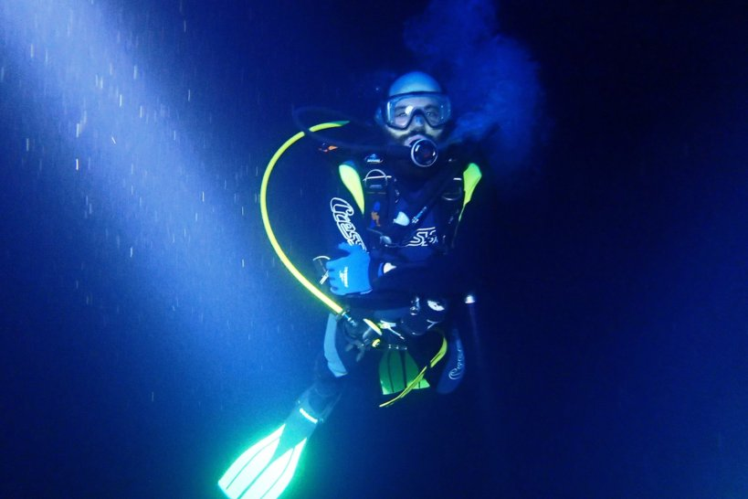
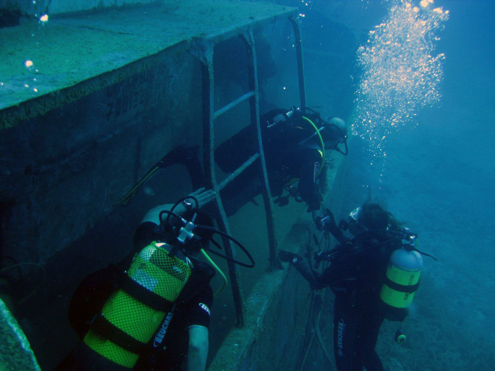

The serenity of the underwater world is so powerful that it washes away all uneasiness and trouble.

Learning scuba diving was one of my most vivid childhood dreams. So much that I enrolled for the open-water course when I barely made the age limit. Now, over a decade later I completed several courses in the row to become a NAUI rescue diver.

I believe that when you decide to do something, you have to do it at a certain standard. With scuba diving it is not enough to be confident in the water, you also have responsibility of your dive buddy and everyone else diving with you!

But what I enjoy the most is socializing before/after a dive. Even if you cannot communicate verbally underwater, scuba diving is truly a team sport. Great company makes it fun and great competence makes it safe.

